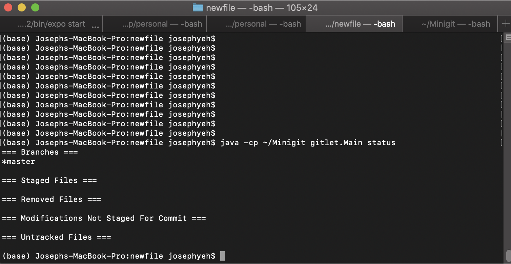
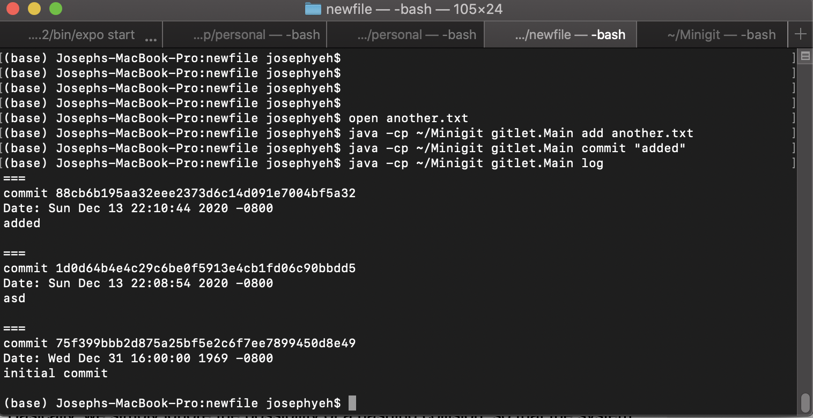
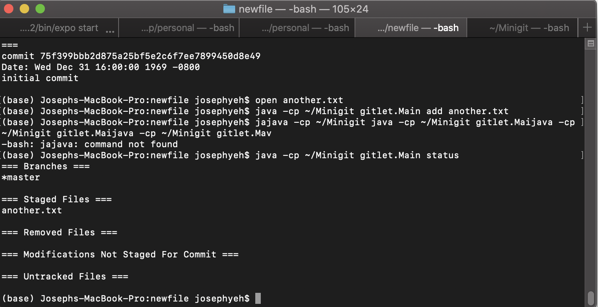

## MiniGit 
##### functionalities: git add, merge, checkout, commit, log, branch, status, and more

## To Run The Program:
### 1. go to the Minigit folder -> run javac gitlet.Main.java
### 2. Make a new folder
### 3. cd into that new folder
### 4. run java {path to Minigit} gitlet.Main whatever command
### 5. example: java {path to Minigit} gitlet.Main init 
### 6. Recommend adding command as alias 

